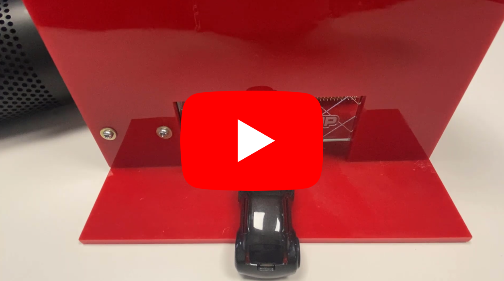

# IoT Solutions for Smart Garage Door Opener

> "Wireless Made Easy!" - Control Smart Garage Door with Wi-Fi using WFI32E Module

Devices: **| WFI32E01 |** 
Features: **| Secure Cloud Connectivity | Voice Control |**

[Back to Main page](../README.md)

## ⚠ Disclaimer

<b>
THE SOFTWARE ARE PROVIDED "AS IS" AND GIVE A PATH FOR SELF-SUPPORT AND SELF-MAINTENANCE. This repository contains example code intended to help accelerate client product development.  

For additional Microchip repos, see: <a href="https://github.com/Microchip-MPLAB-Harmony" target="_blank">https://github.com/Microchip-MPLAB-Harmony</a>

Checkout the <a href="https://microchipsupport.force.com/s/" target="_blank">Technical support portal</a> to access our knowledge base, community forums or submit support ticket requests.

</b>

## A la carte

1. [Introduction](#step1)
1. [Bill of materials](#step2)
1. [Hardware Setup](#step3)
1. [Software Setup](#step4)
1. [Harmony Configuration](#step5)
1. [Run the demo](#step6)

## 1. Introduction

Based on the [OoB MPLAB Harmony project v2.0.2](https://github.com/MicrochipTech/PIC32MZW1_Curiosity_OOB/releases/tag/v2.0.2) and the [WFI32E Curiosity board](http://www.microchip.com/EV12F11A) the Garage door demo has been built to showcase another possibility of the WFI32E device.

Voice commands using Amazon Alexa or the web-app page can be used to control the garage door through Amazon AWS cloud.

**Watch the video and see how to voice control a garage door using a secure cloud connectivity with WFI32E Curiosity board**

## 2. Bill of materials

This demo is using the following components:
- [WFI32E Curiosity board](http://www.microchip.com/EV12F11A)
- [Terminal Click](https://www.mikroe.com/terminal-click) expansion board from mikroE
- [42HS02](https://ww1.microchip.com/downloads/en/DeviceDoc/Leedshine%2042HS03%20Stepper%20Motor%20Datasheet.pdf) stepping motors with 4 leads
- 2x subminiature basic switches
- [Stepper-7 click](https://www.mikroe.com/stepper-7-click)
- 5VDC to power supply the WFI32E Curiosity board
- 15VDC 3A power supply for the motor

## 3. Hardware Setup

The WFI32 device communicates to the 8-bit I/O expander [MCP23S08](https://www.microchip.com/wwwproducts/en/MCP23S08) over the SPI-lines and it allows the control lines of the [MTS62C19A](https://www.microchip.com/wwwproducts/en/MTS62C19A) motor driver IC. By changing states of the [MTS62C19A](https://www.microchip.com/wwwproducts/en/MTS62C19A)'s control pins, it is possible to drive the stepper motor.

Two basic switches are used to detect the garage door position.

To enable the connection with the two switches, the Terminal Click expansion board is used between the Mikro bus interface and the Stepper 7 Click.

The following table showcase the connections between the click board plugged on the Mikro bus connector and the PIC32MZ W1 module pins.

| Mikro Bus (Pin 1 to 8) | Signal | | Mikro Bus (Pin 9 to 16) | Signal |
| ---------------------- | ------ |-| ----------------------- | ------ |
| (1) AN (PA14) | NC | | (16) PWM (PB12) | NC |
| (2) RST (PB6) | MOTOR_RESET_PIN (GPIO, output, high) | | (15) INT (PK6) | NC |
| (3) CS (PB7) | MOTOR_CS_PIN (GPIO, output, high) | | (14) RX (PB9) | NC |
| (4) SCK (PA11) | SCK2 | | (13) TX (PK7) | NC |
| (5) MISO (PK5) | SDI2 | | (12) SCL (PA4) | MOTOR_BOTTOM_SWITCH (GPIO, input, change notification, pull-up) via Terminal-click |
| (6) MOSI (PK4) | SDO2 | | (11) SDA (PA5) | MOTOR_UPPER_SWITCH (GPIO, input, change notification, pull-up) via Terminal-click |
| (7) 3.3V (VCC) | 3.3V | | (10) 5V | 5V |
| (8) GND | GND | | (9) GND | GND

## 4. Software Setup

The Harmony 3 project of the Garage Door Demo is based on OoB project version [2.0.2](https://github.com/MicrochipTech/PIC32MZW1_Curiosity_OOB/releases/tag/v2.0.2) and it is tested with the following software components:

- MPLAB X IDE v6.00
- XC32 Compiler v3.01
- MPLAB® Harmony 3 Launcher Plugin v3.6.4
- MPLAB® Harmony Configurator v3.8.5
  - cryptoauthlib v20211006
  - csp v3.10.0
  - usb v3.8.1
  - wolfssl v4.7.0
  - crypto v3.7.5
  - CMSIS-FreeRTOS v10.3.1
  - core v3.10.0
  - wireless_wifi v3.6.1
  - paho.mqtt.embedded-c v1.2.3
  - dev_packs v3.10.0
  - littlefs
  - wireless_system_pic32mzw1_wfi32e01 v3.6.1
  - net v3.7.4

The manifest file `src/firmware/src/config/pic32mz_w1_curiosity/harmony-manifest-success.yml` has been loaded using **Harmony Content Manager** to get same package configuration as the original project.

## 5. Harmony Configuration 

In MHC (MPLAB Harmony Configurator), SPI2 component is added to allow PIC32MZ W1 device driving the stepper motor mikroE board.
Chip select pin is driven by software.

The pins have been configured to match the hardware connection.

The application `app_motor` has been added in addition to the existing 5 application files to take care of the tasks related to the motor.

The FreeRTOS task `APP_MOTOR_Tasks` is managing the stepper motor by starting the motor (in `app_motor.c`) when desired state is triggered via MQTT message (in `mqtt_app.c`) and stopping the motor by de-energizing the coil when the garage door has reached the position of one of the switches.

## 6. Run the demo

* Unzip the project located in `/firmware` folder
* Open the project in MPLAB X IDE
* Ensure "PIC32MZ W1 Curiosity" is selected as hardware tool to program/debug the application
* Build the code and program the device by clicking on the "Make and Program Device" button in MPLAB X IDE toolbar

* To connect the demo to your own Wi-Fi Access Point, follow the steps described in <a href="https://github.com/MicrochipTech/PIC32MZW1_Workshop/tree/master/04_demo#run-the-demo" target="_blank">Demo section of the PIC32MZ W1 Workshop</a>

* To control Garage Door with voice commands using Amazon Alexa, make sure to register and claim the device using `voice.html`

<a href="#top">Back to top</a>

