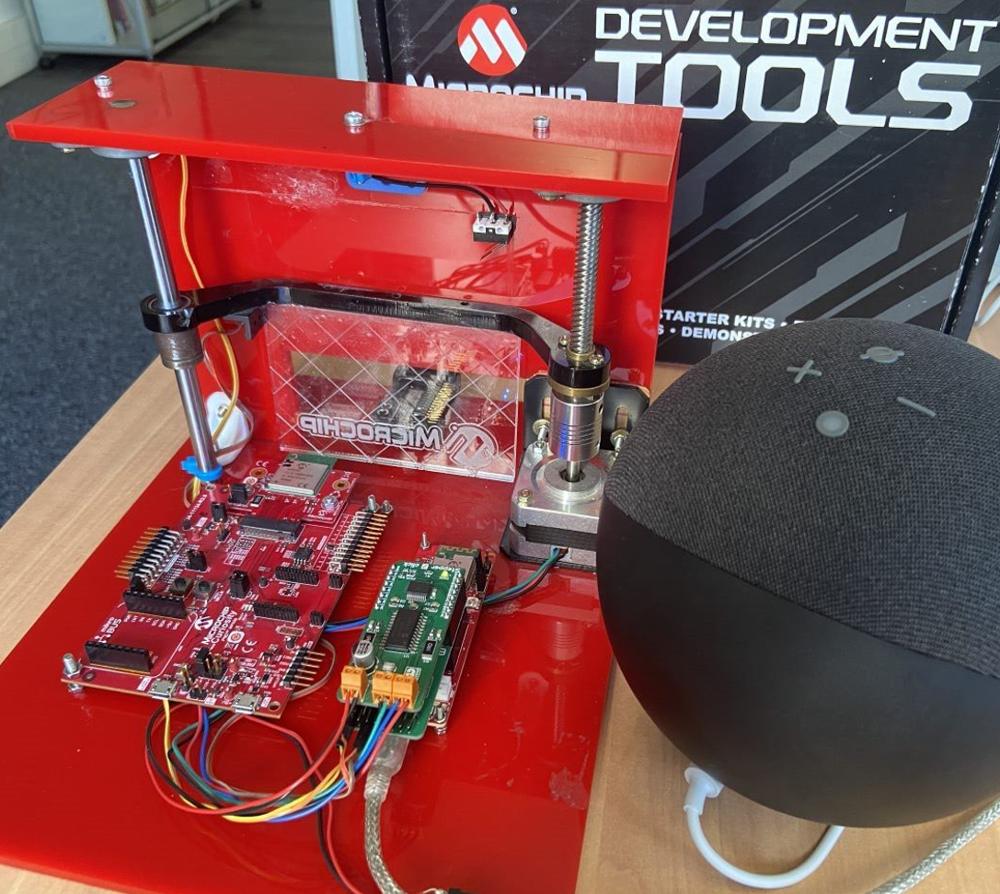
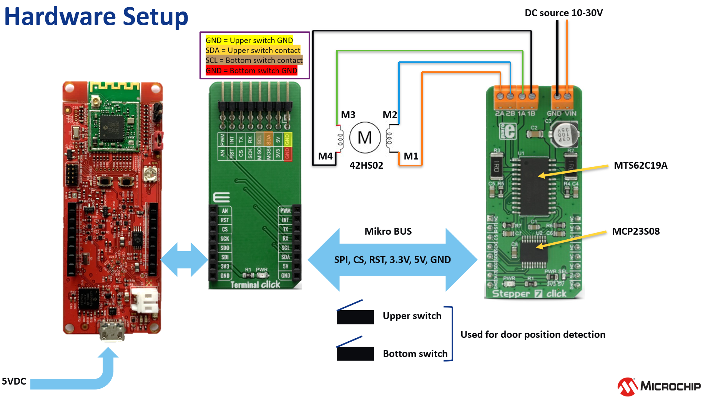
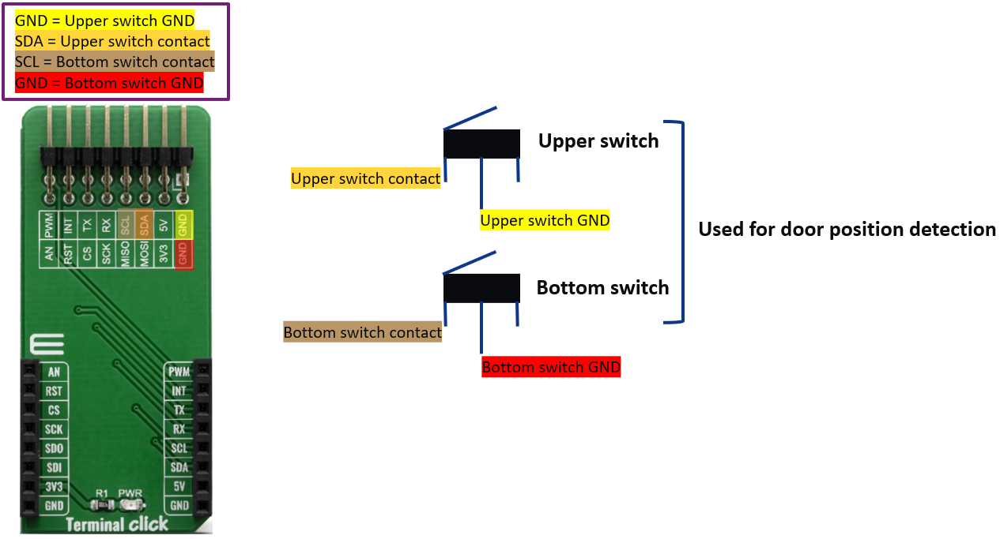
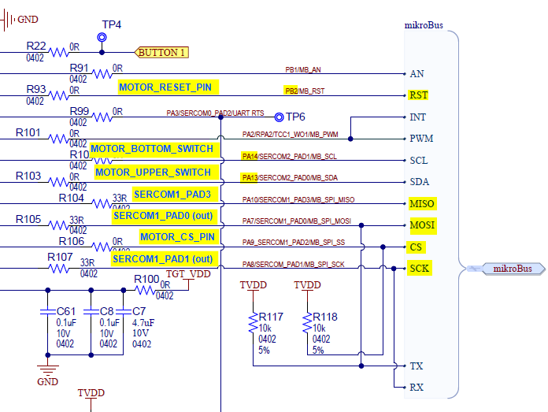
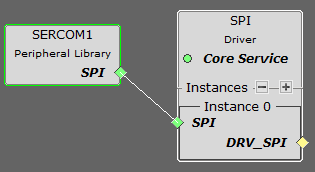
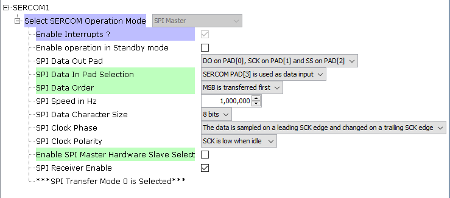
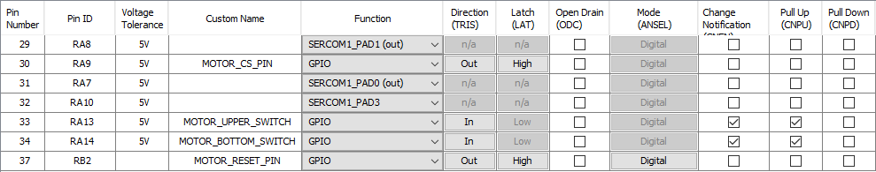
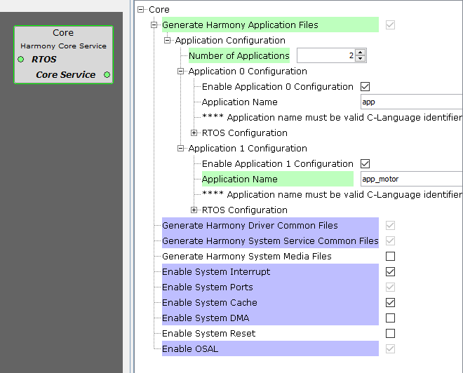
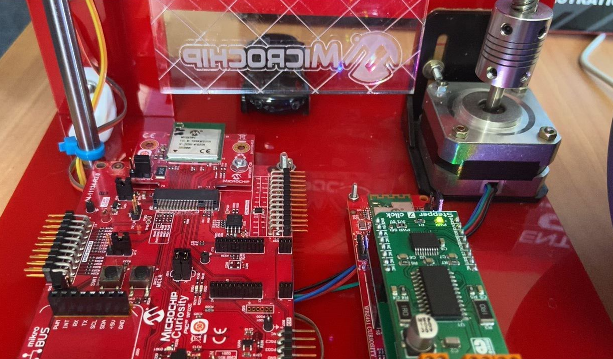
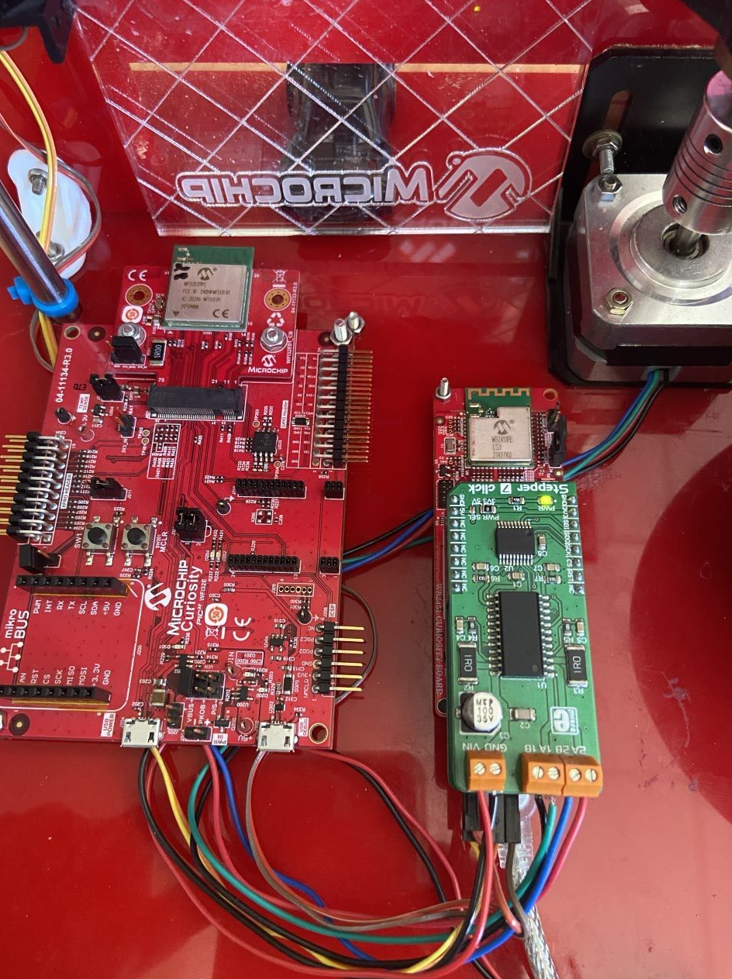

# IoT Solutions for Smart Garage Door Opener

> "Wireless Made Easy!" - Control Smart Garage Door with BLE & Zigbee using WBZ451 Module

Devices: **| WBZ451 |** 
Features: **| Multiprotocol | Voice Control |**

[Back to Main page](../README.md)

## ⚠ Disclaimer

<b>
THE SOFTWARE ARE PROVIDED "AS IS" AND GIVE A PATH FOR SELF-SUPPORT AND SELF-MAINTENANCE. This repository contains example code intended to help accelerate client product development.  

For additional Microchip repos, see: <a href="https://github.com/Microchip-MPLAB-Harmony" target="_blank">https://github.com/Microchip-MPLAB-Harmony</a>

Checkout the <a href="https://microchipsupport.force.com/s/" target="_blank">Technical support portal</a> to access our knowledge base, community forums or submit support ticket requests.

</b>

## A la carte

1. [Introduction](#step1)
1. [Bill of materials](#step2)
1. [Hardware Setup](#step3)
1. [Software Setup](#step4)
1. [Harmony Configuration](#step5)
1. [Run the demo](#step6)

## 1. Introduction

Based on the [OoB BLE Zigbee App project from EA v3.3](https://github.com/MicrochipTech/EA71C53A/releases/tag/v3.3) and the [WBZ451 Curiosity board](https://www.microchip.com/en-us/development-tool/EA71C53A) the Garage door demo has been built to showcase another possibility of the WBZ451 device.

Voice commands using Amazon Alexa or the Alexa App can be used to control the garage door through Amazon AWS cloud.

Microchip Bluetooth Data App can be used as well to locally control the garage door over a BLE connection.

## 2. Bill of materials

This demo is using the following components:
- [WBZ451 Curiosity board](https://www.microchip.com/en-us/development-tool/EA71C53A)
- [Terminal Click](https://www.mikroe.com/terminal-click) expansion board from mikroE
- [42HS02](https://ww1.microchip.com/downloads/en/DeviceDoc/Leedshine%2042HS03%20Stepper%20Motor%20Datasheet.pdf) stepping motors with 4 leads
- 2x subminiature basic switches
- [Stepper-7 click](https://www.mikroe.com/stepper-7-click)
- 5VDC to power supply the WFI32E Curiosity board
- 15VDC 3A power supply for the motor

## 3. Hardware Setup

The WBZ451 communicates to the 8-bit I/O expander [MCP23S08](https://www.microchip.com/wwwproducts/en/MCP23S08) over the SPI-lines and it allows the control lines of the [MTS62C19A](https://www.microchip.com/wwwproducts/en/MTS62C19A) motor driver IC. By changing states of the [MTS62C19A](https://www.microchip.com/wwwproducts/en/MTS62C19A)'s control pins, it is possible to drive the stepper motor.

Two basic switches are used to detect the garage door position.

To enable the connection with the two switches, the Terminal Click expansion board is used between the Mikro bus interface and the Stepper 7 Click.

The following table showcase the connections between the click board plugged on the Mikro bus connector and the WBZ451 module pins.

| Mikro Bus (Pin 1 to 8) | Signal | | Mikro Bus (Pin 9 to 16) | Signal |
| ---------------------- | ------ |-| ----------------------- | ------ |
| (1) AN (PB1) | NC | | (16) PWM (PA2) | NC |
| (2) RST (PB2) | MOTOR_RESET_PIN (GPIO, output, high) | | (15) INT (PA2) | NC |
| (3) CS (PA9) | MOTOR_CS_PIN (GPIO, output, high) | | (14) RX (PA8) | NC |
| (4) SCK (PA8) | SERCOM1_PAD1 (out) | | (13) TX (PA7) | NC |
| (5) MISO (PA10) | SERCOM1_PAD3 | | (12) SCL (PA14) | MOTOR_BOTTOM_SWITCH (GPIO, input, change notification, pull-up) via Terminal-click |
| (6) MOSI (PA7) | SERCOM1_PAD0 (out) | | (11) SDA (PA13) | MOTOR_UPPER_SWITCH (GPIO, input, change notification, pull-up) via Terminal-click |
| (7) 3.3V (VCC) | 3.3V | | (10) 5V | 5V |
| (8) GND | GND | | (9) GND | GND

## 4. Software Setup

The Harmony 3 MCC project of the Garage Door Demo is based on the [OoB BLE Zigbee App project from EA v3.3](https://github.com/MicrochipTech/EA71C53A/releases/tag/v3.3) and it is tested with the following software components:

- MPLAB X IDE v6.00
- XC32 Compiler v4.10
- MPLAB® Code Configurator v5.1.9
- CMSIS v5.8.0
- PIC32CX-BZ_DFP v1.0.80
- MCC Harmony
  - MCC Core v5.4.4
  - MCC Harmony Library v1.1.2
  - CMSIS-FreeRTOS v10.3.1
  - core v3.10.0
  - crypto v3.7.6
  - csp v3.12.0
  - dev_packs v3.12.0
  - wireless from EA v3.3
  - wolfssl v4.7.0

## 5. Harmony Configuration

In Harmony MCC, SERCOM1 PLIB component configured in SPI Master is added to allow WBZ451 device driving the stepper motor mikroE board.
Chip select pin is driven by software.

The pins have been configured to match the hardware connection.

The application `app_motor` has been added in addition to the existing  application file to take care of the tasks related to the motor.

The FreeRTOS task `APP_MOTOR_Tasks` is managing the stepper motor by starting the motor (in `app_motor.c`) when desired state is triggered either via BLE control (in `app_ble_sensor.c`) or either via Zigbee cluster event handler (in `app_zigbee_handler.c`) and stopping the motor by de-energizing the coil when the garage door has reached the position of one of the switches.

## 6. Run the demo

* Unzip the project located in `firmware` folder
* Open the project in MPLAB X IDE
* Ensure "WBZ451 Curiosity" is selected as hardware tool to program/debug the application
* Build the code and program the device by clicking on the "Make and Program Device" button in MPLAB X IDE toolbar

* Make sure your software environment is ready for WBZ451 device by checking-out the <a href="https://github.com/MicrochipTech/EA71C53A/blob/master/Getting%20Started.md" target="_blank">SDK Setup</a>

* Follow the <a href="https://github.com/MicrochipTech/EA71C53A/blob/master/OOBE%20BLE%20Zigbee%20App.pdf" target="_blank">OOBE Demo Guide</a> to run this demo involving provisioning of Zigbee device over a BLE link and monitoring and controling the garage door opener using both the BLE and Zigbee link simultaneously.

<a href="#top">Back to top</a>

