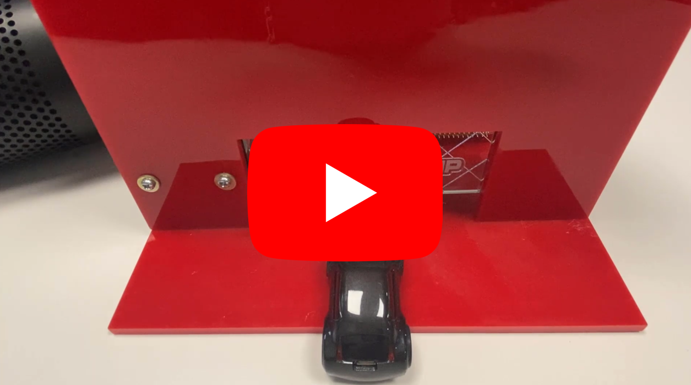
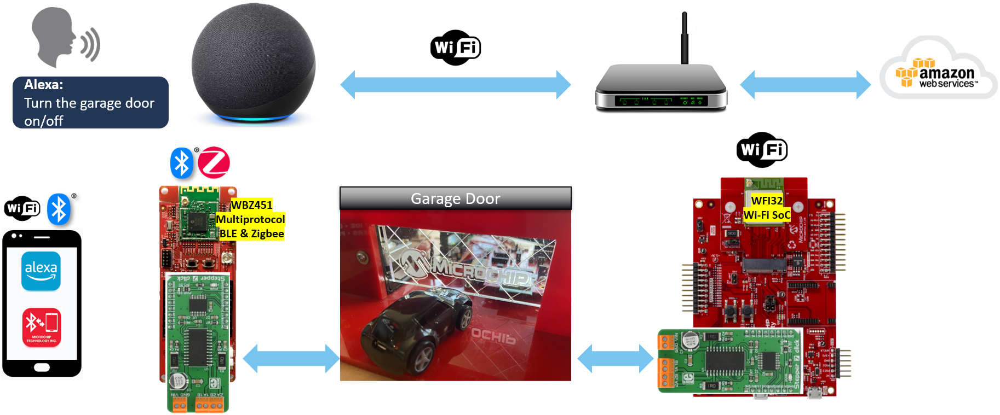

# IoT Solutions for Smart Garage Door Opener

> "Wireless Made Easy!" - IoT Solutions for Smart Garage Door Opener

Devices: **| WFI32E01 | WBZ451 |** 
Features: **| Multiprotocol | Secure Cloud Connectivity | Voice Control |**

## ⚠ Disclaimer

<b>
THE SOFTWARE ARE PROVIDED "AS IS" AND GIVE A PATH FOR SELF-SUPPORT AND SELF-MAINTENANCE. This repository contains example code intended to help accelerate client product development.  

For additional Microchip repos, see: <a href="https://github.com/Microchip-MPLAB-Harmony" target="_blank">https://github.com/Microchip-MPLAB-Harmony</a>

Checkout the <a href="https://microchipsupport.force.com/s/" target="_blank">Technical support portal</a> to access our knowledge base, community forums or submit support ticket requests.

</b>

## Description

With this Smart Garage Door Opener demo from Microchip, the user has the ability to control the garage door over different Wireless technologies. Using Microchip Bluetooth Data Smartphone App to locally control the garage door or control the garage door remotely from Voice Assistant or from Alexa App over AWS Cloud.

## A la carte

1. [Control Smart Garage Door with Wi-Fi using WFI32 Module](01_wifi_solution/README.md#top)
   1. [Introduction](01_wifi_solution/README.md#step1)
   1. [Bill of materials](01_wifi_solution/README.md#step2)
   1. [Hardware Setup](01_wifi_solution/README.md#step3)
   1. [Software Setup](01_wifi_solution/README.md#step4)
   1. [Harmony Configuration](01_wifi_solution/README.md#step5)
   1. [Run the demo](01_wifi_solution/README.md#step6)
1. [Control Smart Garage Door with BLE/Zigbee using WBZ451 Module](02_ble_zigbee_solution/README.md#top)
   1. [Introduction](02_ble_zigbee_solution/README.md#step1)
   1. [Bill of materials](02_ble_zigbee_solution/README.md#step2)
   1. [Hardware Setup](02_ble_zigbee_solution/README.md#step3)
   1. [Software Setup](02_ble_zigbee_solution/README.md#step4)
   1. [Harmony Configuration](02_ble_zigbee_solution/README.md#step5)
   1. [Run the demo](02_ble_zigbee_solution/README.md#step6)
<a href="#top">Back to top</a>

